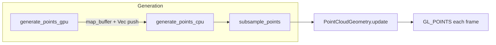
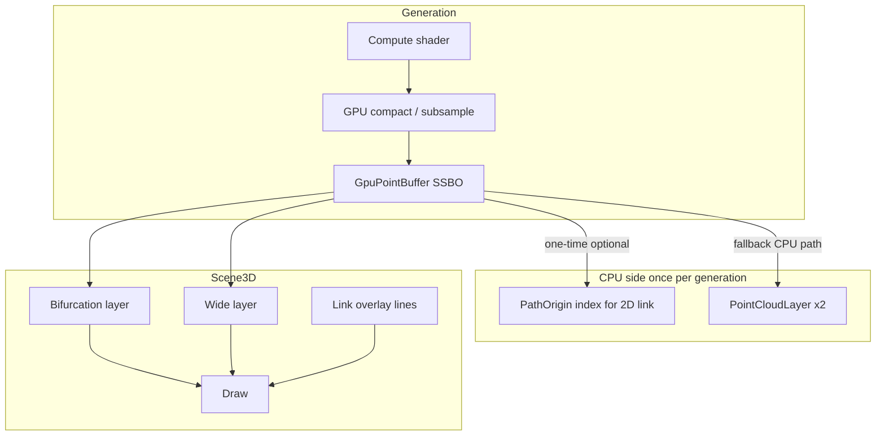

# 3D Visualization Upgrade Plan

## Current state

Today the 3D path is a single merged point cloud:



Key files:
- [`src/gui/brot3d.rs`](src/gui/brot3d.rs) — iteration + GPU compute (hardcoded magma/cool in GLSL)
- [`src/gui/point_cloud.rs`](src/gui/point_cloud.rs) — custom `Geometry` + `PointCloudMaterial`
- [`src/gui/app.rs`](src/gui/app.rs) — `generate_3d()` merges Combined layers into one `Vec`
- [`src/bin/netbrot-gui.rs`](src/bin/netbrot-gui.rs) — fixed camera, single `render_with_material` call

Combined mode currently **merges** bifurcation + wide into one buffer, so per-layer opacity (Python’s 0.12 vs 0.05) is impossible.

---

## Target architecture



---

## Phase 1 — Scene model and separate layers (Item 1)

### New module: [`src/gui/scene3d.rs`](src/gui/scene3d.rs)

Introduce:

```rust
pub enum LayerKind { Bifurcation, Wide }

pub struct PointCloudLayer {
    pub kind: LayerKind,
    pub geometry: PointCloudGeometry,   // CPU path initially
    pub gpu: Option<GpuPointBuffer>,    // GPU path (Phase 4)
    pub material: PointCloudMaterial,   // per-layer opacity + point_size
    pub visible: bool,
    pub count: usize,
}

pub struct LinkOverlay {
    pub c_re: f32,
    pub c_im: f32,
    pub z_min: f32,
    pub z_max: f32,
    // three-d Gm<Mesh, ColorMaterial> vertical line + optional cross on Im=0 plane
}

pub struct Scene3D {
    pub bifurcation: Option<PointCloudLayer>,
    pub wide: Option<PointCloudLayer>,
    pub link: Option<LinkOverlay>,
    pub aabb: AxisAlignedBoundingBox,
}
```

### Refactor [`src/gui/app.rs`](src/gui/app.rs)

- Replace `point_cloud: Option<PointCloudGeometry>` with `scene: Scene3D`.
- Rewrite `generate_3d()`:
  - Generate **bifurcation** and **wide** separately (already split via `combined_pass_params`).
  - Subsample **each layer independently** (preserves tail points per layer; avoids one layer dominating the budget).
  - Default layer materials:
    - Bifurcation: `opacity` ≈ 0.12 equivalent, `point_size` 1.2
    - Wide: `opacity` ≈ 0.05 equivalent, `point_size` 1.0
- UI in “3D Visualization Settings”:
  - Checkboxes: **Show bifurcation / Show wide**
  - Per-layer sliders: opacity, point size

### Refactor [`src/bin/netbrot-gui.rs`](src/bin/netbrot-gui.rs)

- Render loop draws **0–2 layers** + link overlay:

```rust
for layer in app.scene.visible_layers() {
    screen.render_with_material(&layer.material, &camera, &[&layer.geometry], &[]);
}
for obj in app.scene.link_objects() { /* line mesh */ }
```

---

## Phase 2 — Shader visual controls (Items 7, blend, clipping, 10)

Extend [`src/gui/point_cloud.rs`](src/gui/point_cloud.rs) `PointCloudMaterial` and shaders.

### New enums (in `scene3d.rs` or `colormap3d.rs`)

```rust
pub enum BlendMode3d { Transparency, Additive, Opaque }
pub enum ColorMode3d { ReC, PhaseC, HeightZ }
pub enum Colormap3d { Magma, Cool, Plasma, Viridis, Fire, Gray }
```

**Important:** positions are already `(Re(c), Im(c), Re(z))`, so color modes can be toggled **live in the fragment shader** without regenerating points.

### Vertex shader additions

- **Distance-based point size** (Item 7):

```glsl
float distScale = clamp(pointSizeReference / max(-gl_Position.w, 0.01), 0.4, 4.0);
gl_PointSize = basePointSize * distScale * (1.0 + tailEmphasis * tailWeight);
```

- **Clipping planes** (uniforms `clipMin`, `clipMax` vec3):

```glsl
if (any(lessThan(position, clipMin)) || any(greaterThan(position, clipMax))) {
    gl_Position = vec4(2.0, 2.0, 2.0, 1.0); // clip off-screen
    return;
}
```

### Fragment shader additions

- **Colormap functions** in GLSL: `magma`, `cool`, `plasma`, `viridis`, `fire`, `gray` (port from [`src/gui/brot3d.rs`](src/gui/brot3d.rs) + [`src/colorschemes.rs`](src/colorschemes.rs) HSL logic).
- **Color mode** uniform selects scalar `t`:
  - `ReC` → `position.x` normalized by bbox
  - `PhaseC` → `atan(position.y, position.x)`
  - `HeightZ` → `position.z` normalized by z-range (uniform `zMin/zMax` from scene AABB)
- Multiply by layer opacity + existing soft-point + tail boost.

### Blend mode toggle

Map `BlendMode3d` to three-d `RenderStates`:

| Mode | `Blend` | `DepthTest` |
|------|---------|-------------|
| Transparency | `Blend::TRANSPARENCY` | `LessOrEqual` |
| Additive | `Blend::ADD` | `LessOrEqual` |
| Opaque | `Blend::Disabled` | `LessOrEqual` |

### UI controls (app.rs 3D panel)

- Combo: **Color mode** (Re(c) / Phase(c) / Height(z))
- Combo: **Colormap** (6 options — Item 4)
- Combo: **Blend mode**
- Sliders: **Clip Re(c)**, **Clip Im(c)**, **Clip Re(z)** (min/max pairs, default = scene AABB)

---

## Phase 3 — Colormap module (Item 4)

### New [`src/gui/colormap3d.rs`](src/gui/colormap3d.rs)

- `Colormap3d` + `ColorMode3d` enums.
- CPU helpers used during **CPU generation** (until GPU shaders own coloring fully).
- Shared constants: z-range, bbox normalization.
- Re-export colormap snippet strings for GLSL `#include`-style concatenation in `point_cloud.rs`.

Remove duplicated magma/cool GLSL from [`src/gui/brot3d.rs`](src/gui/brot3d.rs) compute shaders; pass `colorMode`/`colormap` uniforms into compute when GPU generation runs (Phase 4).

---

## Phase 4 — Auto-frame camera (Item 2)

### In `Scene3D`

After layer upload, compute AABB from all visible positions:

```rust
pub fn compute_aabb(layers: &[&PointCloudLayer]) -> AxisAlignedBoundingBox
pub fn suggested_camera(aabb: &AxisAlignedBoundingBox) -> (Vec3 eye, Vec3 target, Vec3 up)
```

Heuristic (match Python [`brot_old/brot.py`](brot_old/brot.py) defaults):
- `target` = center of AABB, biased toward chaotic region (centroid of bifurcation layer if present)
- `eye` = target + offset `(-width, -2.5*depth, 0.4*height)`
- `up` = `(0, 0, 1)`

### In [`src/bin/netbrot-gui.rs`](src/bin/netbrot-gui.rs)

- Store `CameraState { eye, target, up, fov }` applied after generation.
- **Reset view** (`R` key) calls `app.scene.suggested_camera()` instead of hardcoded `(-1,-5,1.5)`.
- On generation complete (`points_generated` flip), auto-fit once unless user has manually moved camera (track `camera_user_moved` flag).

---

## Phase 5 — 3D screenshot export (Item 6)

### Approach

Render **without egui overlay** to an offscreen target, then save PNG.

In [`src/bin/netbrot-gui.rs`](src/bin/netbrot-gui.rs) add `render_scene_to_texture()`:

```rust
let color = ColorTexture::new(&context, viewport.width, viewport.height, ...);
let depth = DepthTarget::new(&context, viewport.width, viewport.height);
let target = RenderTarget::new(color, depth);
target.clear(ClearState::color_and_depth(0.05, 0.05, 0.05, 1.0, 1.0));
// render all scene layers (same as screen path)
let pixels: Vec<u8> = target.read_color(); // RGBA
image::save_buffer(path, &rgba, w, h);
```

### UI

- Button **Save 3D view (PNG)** in 3D settings panel.
- Sets `app.screenshot_requested = true`; main loop performs offscreen render + `rfd` save dialog (same pattern as [`save_high_quality`](src/gui/app.rs)).

---

## Phase 6 — 2D ↔ 3D link (Item 12, both directions)

### Shared state in `App`

```rust
pub linked_c: Option<(f64, f64)>,          // selected c in parameter plane
pub link_enabled: bool,
pub pick_index: PathOriginIndex,           // built at generation
```

`PathOriginIndex`: KD-tree or sorted grid of unique `(c_re, c_im)` path origins (~`nx * ny`, not millions).

### 2D → 3D

In [`src/gui/app.rs`](src/gui/app.rs) central panel (2D branch, ~line 285):

- On **click** (not drag): map pixel → `c` using existing bbox math.
- Set `linked_c = Some((re, im))`.
- Update `LinkOverlay` vertical segment at `(re, im)` from `scene.aabb.z_min` to `z_max`.
- Draw in 3D: red/cyan vertical line via `CpuMesh::cylinder` or line strip + bright marker on `Im(c)=0` plane.

### 3D → 2D

In [`src/bin/netbrot-gui.rs`](src/bin/netbrot-gui.rs):

- On **left click** in 3D (when not consumed by egui): cast ray from camera through mouse.
- Find nearest **path origin** to ray–c-plane intersection `(x,y)` using `PathOriginIndex` (O(log n) with KD-tree).
- Set `linked_c`, request 2D overlay update.

### 2D visual feedback

- Draw crosshair / circle at `linked_c` on the 2D texture (egui painter overlay in central panel).
- Label: `c = re + im i`.

### Regeneration note

Link marker uses current scene z-range; if bbox changes on regen, refresh overlay from new AABB.

---

## Phase 7 — GPU buffers, skip readback (largest change)

### New [`src/gui/gpu_point_cloud.rs`](src/gui/gpu_point_cloud.rs)

```rust
pub struct GpuPointBuffer {
    ssbo: glow::Buffer,
    counter: glow::Buffer,
    capacity: usize,
    count: usize,
}

pub struct GpuPointGenCache {
    bifurcation_program: glow::Program,
    wide_program: glow::Program,
    compact_program: glow::Program,
    render_program: glow::Program,  // VS fetches from SSBO
}
```

### Pipeline

1. **Compute** (existing logic from [`brot3d.rs`](src/gui/brot3d.rs)) writes `struct Point { vec4 pos; vec4 color; }` into SSBO.
2. **Compact compute** (new): stride / tail-preserving subsample on GPU → output SSBO + final count (replaces CPU `subsample_points` for GPU path).
3. **Render**: new `GpuPointCloudGeometry` implements `Geometry::draw` with:
   - `glBindBufferBase(SHADER_STORAGE_BUFFER, 0, ssbo)`
   - vertex shader: `pos = points[gl_VertexID].pos`
   - `glDrawArrays(POINTS, 0, count)`
4. **Delete** `map_buffer` + `Vec::push` loop in `generate_points_gpu`.

### CPU fallback

When compute unavailable: keep current CPU path → `PointCloudGeometry::update` (no regression).

### Pick buffer (for 3D→2D without full readback)

After GPU compact, **one** small readback of path-origin table only (`nx*ny` pairs), not full point cloud. Built during compute via separate atomic per path thread (or derived from dispatch coords). Stored in `PathOriginIndex`.

### Refactor [`src/gui/brot3d.rs`](src/gui/brot3d.rs)

- Split: `compute_points_gpu(...) -> GpuPointBuffer` (no `Vec` return).
- Move shader strings + cache to `gpu_point_cloud.rs`.
- Fix OpenGL version detection (parse major.minor ≥ 4.3, not string contains).

---

## File change summary

| File | Action |
|------|--------|
| [`src/gui/scene3d.rs`](src/gui/scene3d.rs) | **New** — layers, AABB, camera fit, link overlay |
| [`src/gui/colormap3d.rs`](src/gui/colormap3d.rs) | **New** — enums + CPU/GLSL colormap helpers |
| [`src/gui/gpu_point_cloud.rs`](src/gui/gpu_point_cloud.rs) | **New** — SSBO lifecycle, compact + render shaders |
| [`src/gui/point_cloud.rs`](src/gui/point_cloud.rs) | Extend shaders (clip, blend, color mode, dist attenuation) |
| [`src/gui/brot3d.rs`](src/gui/brot3d.rs) | Layer-aware generation API; delegate GPU to new module |
| [`src/gui/app.rs`](src/gui/app.rs) | Scene state, UI controls, 2D click, screenshot flag |
| [`src/gui/mod.rs`](src/gui/mod.rs) | Export new modules |
| [`src/bin/netbrot-gui.rs`](src/bin/netbrot-gui.rs) | Multi-pass render, camera fit, 3D pick, offscreen screenshot |

---

## Implementation order (recommended)

1. **Phase 1** — layers (unblocks per-layer opacity; matches Python workflow)
2. **Phase 2 + 3** — shader controls + colormaps (immediate visual wins, no GPU rework)
3. **Phase 4** — auto-frame camera
4. **Phase 6** — 2D↔3D link (2D→3D first, then 3D pick with path index)
5. **Phase 5** — screenshot (depends on multi-pass render from Phase 1)
6. **Phase 7** — GPU SSBO pipeline (replace readback last; highest risk)

---

## Testing checklist

- Combined mode: toggle bifurcation/wide independently; wide visible as faint shell
- Color mode + colormap switches without regen
- Clip sliders hide dense band to reveal rays
- Additive blend makes sparse tails visible (center may saturate — expected)
- Load `data/rotation_behaviour.json`, generate, **Reset view** frames exhibit
- Click 2D → vertical line in 3D; click 3D → crosshair in 2D
- Save 3D PNG matches on-screen scene (no egui panels)
- GPU path: generation time drops vs readback; point count matches compact budget
- CPU fallback still works on GL &lt; 4.3
